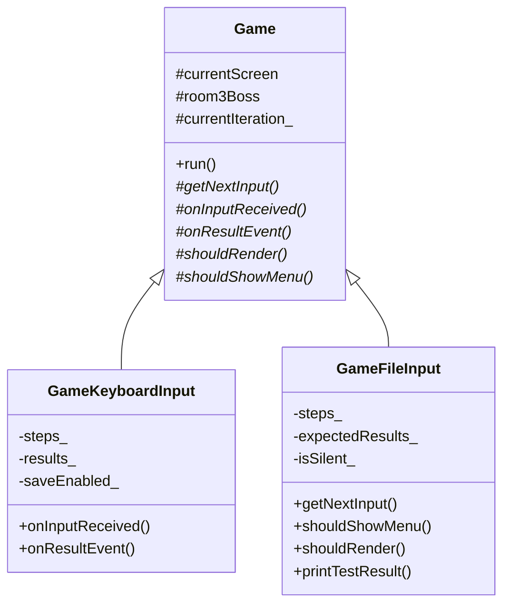

# Game Base Refactoring - Comprehensive Walkthrough
## Exercise 3: Recording and Replay Functionality

---

## Overview

This document explains the complete refactoring done to implement Exercise 3. The goal is to add **recording and replay functionality** using OOP principles (inheritance and polymorphism).

| Phase | Description | Status |
|-------|-------------|--------|
| **Phase 1** | Infrastructure (Steps + Results classes) | ✅ Complete |
| **Phase 2** | Virtual Hooks in Game base class | ✅ Complete |
| **Phase 3** | Derived Classes (GameKeyboardInput, GameFileInput) | ✅ Complete |
| **Phase 4** | Entry Point + CLI (Main.cpp updates) | ⏳ Not Yet Done |
| **Phase 5** | Test Files + Documentation | ⏳ Not Yet Done |

---

# Phase 1: Infrastructure ✅

> **Goal:** Create the data structures needed to record and replay game sessions.

## Files Created
- [Steps.h](file:///c:/Users/Nitzan%20Gal/Documents/GitHub/cpp-text-adventure/Steps.h) / [Steps.cpp](file:///c:/Users/Nitzan%20Gal/Documents/GitHub/cpp-text-adventure/Steps.cpp)
- [Results.h](file:///c:/Users/Nitzan%20Gal/Documents/GitHub/cpp-text-adventure/Results.h) / [Results.cpp](file:///c:/Users/Nitzan%20Gal/Documents/GitHub/cpp-text-adventure/Results.cpp)

---

## Steps Class

**Purpose:** Records every key press during gameplay with its exact game cycle (iteration). This allows deterministic replay.

### Data Structures

```cpp
struct StepEntry {
    size_t iteration;   // Game cycle when the key was pressed
    int playerId;       // 1 or 2 (two-player game)
    char key;           // The key that was pressed
};

class Steps {
    unsigned long randomSeed_;              // For Room3Boss RNG
    std::vector<std::string> screenFiles_;  // Screen files used
    std::list<StepEntry> steps_;            // Recorded steps
};
```

### Key Methods

| Method | Purpose |
|--------|---------|
| `loadFromFile(filename)` | Load steps from `.steps` file for replay |
| `saveToFile(filename)` | Save recorded steps to file |
| `setRandomSeed(seed)` | Store RNG seed for boss room replay |
| `addStep(iteration, playerId, key)` | Record a key press |
| `isNextStepOnIteration(iteration)` | Check if next step matches current cycle |
| `popStep()` | Get and remove next step for replay |

### File Format (`adv-world.steps`)

```
<random_seed>
<screen1.screen>,<screen2.screen>,<screen3.screen>
<iteration> <player_id> <key>
...
```

**Example:**
```
1126025823
adv-world_01.screen,adv-world_02.screen,adv-world_03.screen
14 1 d
58 2 j
68 1 a
```

---

## Results Class

**Purpose:** Records significant game events for verification during replay. In silent mode, actual results are compared against expected results.

### Data Structures

```cpp
enum class ResultType {
    ScreenTransition = 0,  // Player moved to another screen
    LifeLost = 1,          // Player lost a life
    RiddleEncounter = 2,   // Player encountered a riddle
    GameFinished = 3       // Game completed
};

struct ResultEntry {
    size_t iteration;      // Game cycle when event occurred
    int playerId;          // 1 or 2 (0 for game-wide events)
    ResultType type;       // Type of event
    int screenId;          // For ScreenTransition
    int riddleId;          // For RiddleEncounter
    bool riddleCorrect;    // For RiddleEncounter
    int finalScore;        // For GameFinished
};
```

### Key Methods

| Method | Purpose |
|--------|---------|
| `addScreenTransition(...)` | Record screen change |
| `addLifeLost(...)` | Record player death |
| `addRiddleEncounter(...)` | Record riddle event |
| `addGameFinished(...)` | Record game end |
| `popResult()` | Get next expected result for verification |

---

# Phase 2: Virtual Hooks ✅

> **Goal:** Add virtual methods to the Game base class that derived classes can override (Template Method pattern).

## Files Modified
- [Game.h](file:///c:/Users/Nitzan%20Gal/Documents/GitHub/cpp-text-adventure/Game.h) / [Game.cpp](file:///c:/Users/Nitzan%20Gal/Documents/GitHub/cpp-text-adventure/Game.cpp)
- [Player.h](file:///c:/Users/Nitzan%20Gal/Documents/GitHub/cpp-text-adventure/Player.h)
- [Room3Boss.h](file:///c:/Users/Nitzan%20Gal/Documents/GitHub/cpp-text-adventure/Room3Boss.h)

---

## Virtual Hooks Added

| Hook | Default Behavior | Override Purpose |
|------|------------------|------------------|
| `getNextInput()` | Reads from keyboard | Read from file instead |
| `onInputReceived(...)` | Empty (no-op) | Record steps to file |
| `onResultEvent(...)` | Empty (no-op) | Record/verify events |
| `shouldRender()` | Returns `true` | Disable for silent mode |
| `getSleepDuration()` | Returns 50ms | Faster replay (10ms/0ms) |
| `shouldShowMenu()` | Returns `true` | Skip menu in load mode |

---

## Protected Members

Made accessible to derived classes:

```cpp
protected:
    Screens currentScreen;
    Room3Boss room3Boss;
    size_t currentIteration_ = 0;  // Game cycle counter
    int score = 0;
```

---

## onResultEvent Call Points

| Location | Event Type | What It Records |
|----------|------------|-----------------|
| `tryAdvanceToNextScreen()` | 0 | Screen transition |
| `decrementLife()` | 1 | Life lost |
| `handleRiddleEncounter()` | 2 | Riddle encounter |
| `showGameOverScreen()` | 3 | Game finished |

---

## Room3Boss RNG Seed

Added getter/setter for deterministic replay:

```cpp
// Room3Boss.h
unsigned long getRngSeed() const;
void setRngSeed(unsigned long seed);
```

> [!IMPORTANT]
> The boss room generates random math tasks. To replay correctly, the RNG seed must be captured when recording and restored before replay.

---

# Phase 3: Derived Classes ✅

> **Goal:** Create two derived classes for different running modes.

## Files Created
- [GameKeyboardInput.h](file:///c:/Users/Nitzan%20Gal/Documents/GitHub/cpp-text-adventure/GameKeyboardInput.h) / [GameKeyboardInput.cpp](file:///c:/Users/Nitzan%20Gal/Documents/GitHub/cpp-text-adventure/GameKeyboardInput.cpp)
- [GameFileInput.h](file:///c:/Users/Nitzan%20Gal/Documents/GitHub/cpp-text-adventure/GameFileInput.h) / [GameFileInput.cpp](file:///c:/Users/Nitzan%20Gal/Documents/GitHub/cpp-text-adventure/GameFileInput.cpp)

---

## Class Hierarchy



---

## GameKeyboardInput

**Purpose:** Normal gameplay + optional `-save` mode

```cpp
class GameKeyboardInput : public Game {
    Steps steps_;
    Results results_;
    bool saveEnabled_ = false;
    
public:
    explicit GameKeyboardInput(bool saveToFiles = false);
    ~GameKeyboardInput() override;  // Saves files on exit
    
protected:
    void onInputReceived(...) override;  // Records steps
    void onResultEvent(...) override;    // Records results
};
```

**Usage:**
```cpp
// Normal mode
GameKeyboardInput game(false);
game.run();

// Save mode (-save)
GameKeyboardInput game(true);
game.run();  // Files saved on exit
```

---

## GameFileInput

**Purpose:** Replay modes (`-load` and `-load -silent`)

```cpp
class GameFileInput : public Game {
    Steps steps_;
    Results expectedResults_;
    bool isSilent_ = false;
    bool testPassed_ = true;
    
public:
    explicit GameFileInput(bool silent = false);
    
protected:
    char getNextInput() override;           // Reads from file!
    bool shouldShowMenu() const override;   // Returns false
    bool shouldRender() const override;     // Returns !isSilent_
    int getSleepDuration() const override;  // 0 or 10ms
    
public:
    void printTestResult() const;  // "Test PASSED" or "Test FAILED"
};
```

**Usage:**
```cpp
// Load mode (visual replay)
GameFileInput game(false);
game.run();

// Silent mode (verification only)
GameFileInput game(true);
game.run();
game.printTestResult();
```

---

# Phase 4: Entry Point + CLI ⏳

> **Status:** Not yet implemented

## Planned Changes to Main.cpp

```cpp
int main(int argc, char** argv) {
    bool isLoad = hasArg(argc, argv, "-load");
    bool isSave = hasArg(argc, argv, "-save");
    bool isSilent = hasArg(argc, argv, "-silent");
    
    std::unique_ptr<Game> game;
    
    if (isLoad) {
        game = std::make_unique<GameFileInput>(isSilent);
    } else {
        game = std::make_unique<GameKeyboardInput>(isSave);
    }
    
    game->run();
    
    if (isLoad && isSilent) {
        static_cast<GameFileInput*>(game.get())->printTestResult();
    }
    
    return 0;
}
```

## Command-Line Usage

| Command | Mode | Behavior |
|---------|------|----------|
| `cpp-texy-adventure.exe` | Normal | Exercise 2 behavior |
| `cpp-texy-adventure.exe -save` | Save | Normal + record files |
| `cpp-texy-adventure.exe -load` | Load | Visual replay |
| `cpp-texy-adventure.exe -load -silent` | Silent | Verification only |

---

# Phase 5: Test Files + Documentation ⏳

> **Status:** Not yet implemented

## Planned Deliverables

1. **files_format.txt** - Explains `.steps` and `.result` file formats
2. **3 example file pairs:**
   - Simple gameplay
   - Riddle encounter
   - Boss room completion

---

# Testing Instructions (After Phase 4)

## Test 1: Normal Mode

```bash
cpp-texy-adventure.exe
```

✅ Menu appears  
✅ Game plays normally  
✅ No files created  

---

## Test 2: Save Mode

```bash
cpp-texy-adventure.exe -save
```

**Steps:** Play briefly, exit game

✅ `adv-world.steps` created  
✅ `adv-world.result` created  

---

## Test 3: Load Mode

```bash
cpp-texy-adventure.exe -load
```

✅ NO menu appears  
✅ Players move automatically  
✅ Keyboard ignored  

---

## Test 4: Silent Mode

```bash
cpp-texy-adventure.exe -load -silent
```

✅ No visual output  
✅ Instant completion  
✅ Prints "Test PASSED" or "Test FAILED"  

---

# Summary

## Completed Files

| New Files | Modified Files |
|-----------|----------------|
| Steps.h/cpp | Game.h/cpp |
| Results.h/cpp | Player.h |
| GameKeyboardInput.h/cpp | Room3Boss.h |
| GameFileInput.h/cpp | Screens.h |
| | vcxproj |

## Remaining Work

- [ ] Update Main.cpp with argument parsing
- [ ] Create files_format.txt
- [ ] Create 3 example test file pairs
- [ ] Test all 4 command combinations
